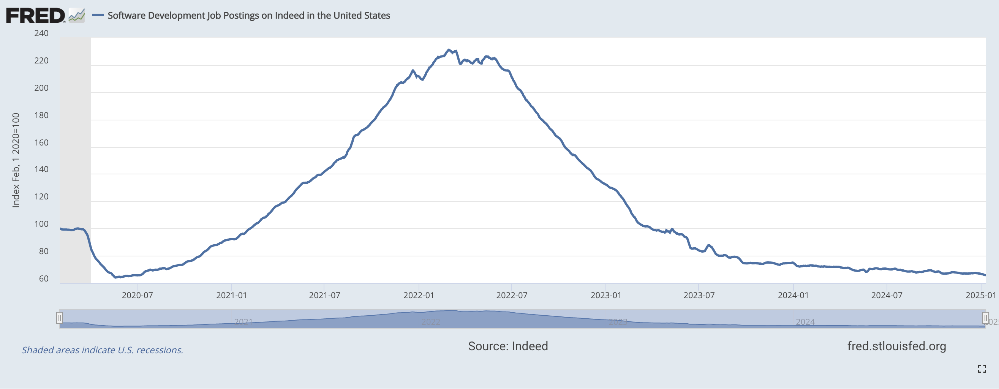

## The Diagnosis
SaaS (software as a service), the categorical Silicon Valley darling, is about to go through a giant upheaval - and it's already happening. Dev jobs are either being offshored or companies are hiring via contract only and the glory days of getting paid 6 figs for an overpaid CRUD engineering gig will be a thing of the past in a couple years. As a recent example, Salesforce notoriously decided not to hire any Software Engineers this year. See article [here](https://www.salesforceben.com/salesforce-will-hire-no-more-software-engineers-in-2025-says-marc-benioff/).

Companies are now starting to realize their only real moat was sales connections or tech execution. While these were once formidable advantages, AI-powered tools are making both increasingly accessible to newcomers with minimal investment. Tech famously does not have an IP regulatory regime that prevents companies from copying functionality or features which resulted in breakneck innovation, but due to AI this is causing labor commoditization. 

And the commoditization will seemingly continue and the tech roles will be reduced.

Even PG is getting blown away.
<blockquote class="twitter-tweet">

I talked to the CEO of a moderately big tech co who said they'd replaced Figma with Replit. This surprised me because I don't even think of them as being in the same business. But he said Replit is so good at generating apps that they just go straight to prototype now.
&mdash; Paul Graham (@paulg) <a href="https://twitter.com/paulg/status/1880594118927430068?ref_src=twsrc%5Etfw">January 18, 2025</a>
</blockquote>

## The Decline
Unfortunately, there is no sign of this slowing down. If you check out this FRED graph here it shows the number of software development job postings on Indeed -- presumably with the blow up due to the pandemic, but now the numbers are below pre-pandemic levels.

This is a mark of not only the menial software engineering role becoming less valuable, but the tech sector as a whole. It turns out after all the years of the middle managers telling their manager that the bottleneck was a engineering shortage, the real issue was actual value creating ideas and the risk appetite to execute them. 

It will probably get worse, or at the very least the bar for software engineering will rise in order to maintain employment at legacy companies.  It seems clear if you want to continue working in tech lucratively, you need to start building in your spare time. The risk of not building and learning outside of the typical work domain is your specialized engineering domain will just be cannibalized by generic AI prompts and the current job will slowly become a relic of the past. Similar to the days of using morse code to send a message -- sure, in 2025 you can write bespoke code but wouldn't it be easier to just prompt features into existence instead? See [Replit](https://replit.com), [Cursor](https://cursor.sh), [v0](https://v0.dev).

Domain specific software engineering roles are the most at risk. 

Frontend, backend, and devops specialization where one domain engineer may not have to know about the impliementation or skills to contribute in another domain will soon see their value diminish -- not because their skills are not needed, but because with the speed of execution enabled by AI, teams will find there is not enough actionable, business value generating work to go around.

The engineer that can do a bit of everything will end up surviving and the engineer that is domain specific will face fierce competition with the dwindling number of domain constraining roles that exist. The true "full stack" engineer will be the new normal.

So what can be avoided here to ensure you don't get caught in the wave of commoditization?

A natural answer might seem to be "start your own company", as one can use the commoditization to their advantage - but even that path has become more complex in the AI era.

## Building a Business
The issue is that in 2025, if you want to start a tech company (probably SaaS), you need to have a predictable amount of staying power. Now there is no guaruntee that your product will last longer than a couple years before being commoditized. Especially if you're b2b SaaS.

You used to be able to leverage talented engineers to build a product that was unique and had a moat solely based on execution. However, the replicative nature of AI has flipped execution moats on its head, and companies are already starting to realize that they can leverage productivity gains from AI to build all of their b2b 3rd party tooling inhouse for a fraction of the cost. As long as it has been done before, with just the right amount of compute, AI can quickly replicate work that has already been done to the right prompter. Execution moats are largely dead.

 At one point there was a meme floating around that every time OpenAI did a product release, an entire batch of YC companies would be wiped out. Now that their are OpenAI competitors, it is even more difficult to build an execution moat in SaaS that can predictably guarantee your startup will have PMF or pricing power in 2 years.

This of course does not mean there will not be new winners. The space of AI and tooling is still wide open, but the competition is more and more fierce. This is even indicative for VCs, many indicating that they have no idea who will win long term. 

The kicker here is software is still integral to every business going forward but the only pure software businesses that have staying power will be ones with network effects -- the traditional SaaS model is being commoditized.

## Bright Spots
Despite AI's disruptive impact on traditional software work, we're entering an exciting era where software's benefits can finally extend beyond pure digital products. For the past two decades, most technical talent gravitated toward software because that's where the money and opportunity were. Now in 2025, as software development costs plummet due to AI, we're seeing a renaissance in hardware innovation and real-world services.

The most promising opportunities lie in businesses that combine software with physical products or tangible services - areas that have historically been underserved by pure software solutions. Think:

- Hardware innovation (rockets, robotics, VR devices)
- Infrastructure and logistics (autonomous vehicles, drones)
- Healthcare and biotech (medical devices, diagnostic tools)
- Physical services augmented by software
- Defense and security systems

These sectors benefit from natural moats that pure software struggles to replicate: physical infrastructure, regulatory requirements, and complex supply chains. While software remains crucial to these businesses, it's no longer the primary differentiator - it's an enabler for solving real-world problems outside of the world of bits.

This realization has led me to explore opportunities in the physical storage industry - a decidedly unsexy business that's been around for decades. While it won't make TechCrunch headlines or attract VC bidding wars, storage is a stable, recession-resistant industry that's largely ignored by tech talent. Unlike many digital services that risk AI commoditization, people will always need physical space to store their belongings - no amount of artificial intelligence can digitize your furniture or holiday decorations. (I'll be exploring this more in a future post)

