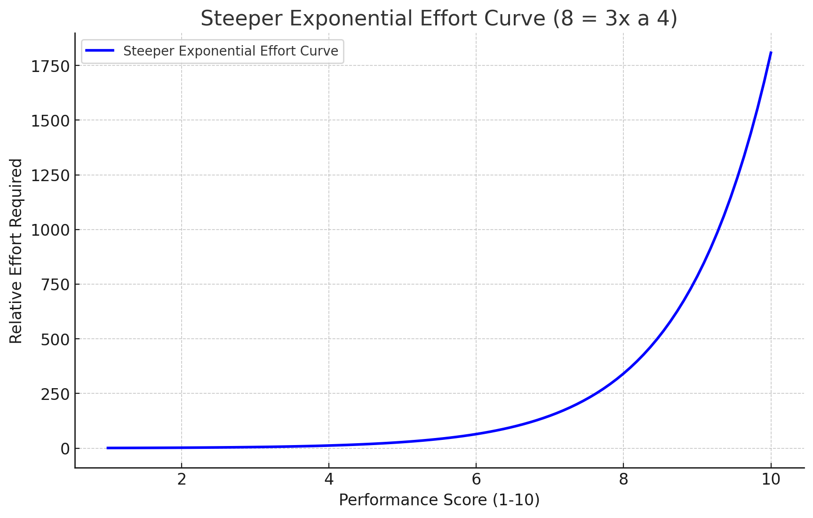
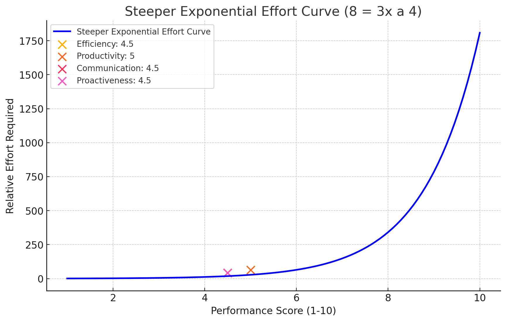

# **Performance Check-in & Expectations Moving Forward**

## **Performance Rubric & Expectations**  

To set clear expectations, I'm outlining the key areas I'm evaluating in this role. Since this is a **startup environment**, speed, execution, and proactiveness are critical. The work needs to **justify itself** by significantly increasing output beyond what I could do alone.  

### **Performance Categories & Grading Scale**  

Each category is graded on a **1-10 scale**, where **5 is the absolute minimum acceptable standard** and **8+ represents high performance.** The effort required to improve is **exponential, not linear**—small improvements won't be enough; a major shift in execution is needed.  

### **Key Performance Heuristic: Actions per Communication per Time**

The core metric we optimize for is **maximizing actions per communication per unit of time**. This means:
- Each communication should enable multiple concrete actions
- Proactively seek clarity when needed to maintain momentum
- Don't delay communication to artificially inflate action count
- Optimize for continuous flow of work rather than batch updates
- Questions should be structured to unblock multiple next steps

1️⃣ **Efficiency (Speed of Execution)**  
   - **1-4:** Work is consistently slow or delayed beyond reasonable timeframes.  
   - **5:** Bare minimum—tasks are completed on time but without urgency or iteration.  
   - **6-7:** Work is mostly on time, but there's little optimization or speed improvement.  
   - **8-10:** Work is done **quickly and iteratively**, allowing for multiple refinements before finalization.  

2️⃣ **Productivity (Overall Output & Work Volume)**  
   - **1-4:** Work produced is low and does not reflect full-time effort.  
   - **5:** Meets minimum expectations but isn't driving significant impact.  
   - **6-7:** Output is steady but not at a pace that moves the business forward.  
   - **8-10:** Produces **3-5x what I could do alone**, enabling significant progress.  

3️⃣ **Communication (Responsiveness & Proactive Updates)**  
   - **1-4:** Updates are infrequent, delayed, or only come when asked.  
   - **5:** Responds when prompted but lacks proactive updates.  
   - **6-7:** Engages semi-regularly but doesn't fully anticipate communication needs.  
   - **8-10:** Proactively shares progress, asks questions, and engages in strategic discussions.  

4️⃣ **Proactiveness (Taking Initiative & Problem-Solving)**  
   - **1-4:** Requires constant guidance and does not anticipate next steps.  
   - **5:** Does what is asked but does not take extra initiative.  
   - **6-7:** Occasionally takes initiative but still waits on some direction.  
   - **8-10:** Fully **owns responsibilities, suggests solutions**, and **executes without waiting.**  

---

## **Case Study: Postcard Design Project**

To illustrate current performance levels, let's examine a recent postcard design project:

### **Our Timeline**
- Total time: 1 week from ideation to completion
- Deliverables: 1 variation with a handful of edits
- Cost: Internal resource time (significantly higher than market rate)

### **Market Comparison (Fiverr)**
- Turnaround: 12-24 hours standard (under 6 hours with rush delivery)
- Cost: $13.50 base rate (~$20 for expedited)
- Multiple revisions included
- [Reference: on Fiverr](https://www.fiverr.com/graphizhub/do-party-event-church-business-book-release-flyer-design)

### **Performance Analysis**
- Current grade: 3-4/10
- Time efficiency: 5-7x slower than market standard
- Cost efficiency: Significantly higher than market rate
- Output volume: Single variation vs. market standard of multiple options

### **Context & Implications**
- At 52 weeks per year, if each week produced similar output (equivalent to one postcard design), this would be severely underperforming
- Market alternatives deliver:
  - Faster turnaround (5-7x quicker)
  - Lower cost
  - More variations per project
- **Required Improvement:** Work output and initiative needs to increase by at least 5x to justify the role and equity potential

---

## **Current Performance Overview**  

| **Category**       | **Current Score (1-10)** |
|-------------------|----------------------|
| **Efficiency** (Speed of execution) | **3-4** |
| **Productivity** (Overall output) | **4** |
| **Communication** (Responsiveness & proactive updates) | **3-4** |
| **Proactiveness** (Taking initiative without waiting for direction) | **3** |

---

## **The Effort Required to Improve is Exponential**  

The difference between a **5 and an 8+ isn't small—it's a massive shift in execution.** Below is a graph illustrating how the effort required to increase performance scales exponentially.  

  

This means that **minor improvements won't be enough**—the work needs to scale significantly in both quality and volume.  

---

## **The Reality: More Work & More Impact Needed**  

This role needs to reflect a **full-time workload**—right now, the **effort and execution speed aren't at the level required.**  

- **Hours worked need to increase.** If I were doing this alone, I'd be moving faster—even with my current constraints. That shouldn't be the case.  
- **Waiting for direction slows everything down.** If you're unsure, **err on the side of doing.** I'd rather refine work in progress than wait for something to happen.  
- **Communication needs to be proactive.** I need regular progress markers—not just responses when I follow up.  
- **Execution should reflect multiple iterations, not single outputs.** The current pace is too slow to justify the overhead of delegation.  

---

## **What Needs to Change Immediately**  

✅ **More work needs to be done—this must reflect a full-time workload.**  
✅ **Velocity must increase significantly—tasks should move quickly, not stretch over multiple days.**  
✅ **Proactive engagement is required—I shouldn't have to check in to know what's happening.**  

---

## **The Reality: This Needs to Justify Itself**  

This role comes with **significant equity potential**, but that means **the impact has to be 3-5x what I could do on my own.** That only happens if both the **hours worked and the output scale significantly.**  

If this pace is just how you work, that's okay—but it means this **isn't a fit.** If you can step up, I want to see that **immediately—starting this week.**  

